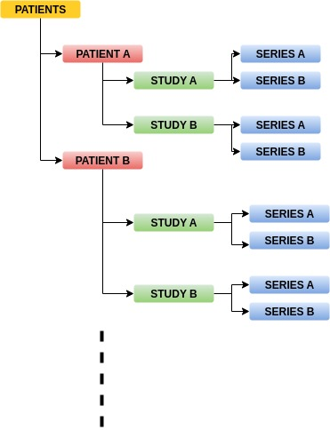

# Prostate Net Loader

Prostate Net Loader contains functions to assist the Data Mining and loading process of Patients originated from the ProCAncer-AI Horizon's 2020 project.  
The package is under construction for the time being therefore any suggestion would be appreciated.

## Prerequisites

Before proceeding to *ProstateNetLoader*, you will need to utilize the Series Parser Docker implemented by *José Guilherme Almeida* and extract the metadata in csv format. Open "ParquetParser_Examples.ipynb" for a detailed demonstaration in how to utilize the Docker Series Parser pipeline! In addition, an example of the format of the input .tsv and the output .csv are located into the "SeriesDockerFiles" folder.

## Requirements
```bash
SimpleITK == 2.2.1
numpy == 1.21.5
pandas == 1.4.4
pydicom == 2.3.1
```

## Installation

Install the project via pip or pull the repo

```bash
pip install ProstateNetLoaders == 0.0.1
```
    
## Usage/Examples Series Parser tool
Detailed explanation of the series parser tool is presented at the ParquetParser_Examples.ipynb
## Usage/Examples PROSTATENETLOADER Module

Examples could be found in Module_Examples.ipynb regarding the package. An example for a single patient is presented below

### Single Patient
a) Import Libraries
```python
import pandas as pd
import SimpleITK as sitk
import ProstateNetLoaders
```
b) Set the patient folder path and the csv extracted by the sequence selector tool
```python
pth = "PCa-..."
metadata= pd.read_csv("results.csv", 
                names=["patient_id", "study_uid", 
                "series_uid", "series_type", "series_type_heuristics"])
```
c) Execute loaders and pick orientation ("AX","COR", "SAG") and sequence ("T2","ADC","DWI") and whether to be AI sequence parser (Heuristics = False) or Heuristics = True
```python
a = ProstateNetLoaders.ExecuteLoader.Execute(pth, metadata,  Heuristics = True) 
a.LoadArrays(orientation="AX", seq="T2")
```
d) Get dictionaries where keys are the series names, values are the Image numpy arrays
```python
pat,ann = a.GetItems() 
```

### Batch Loading 

The structure of the folders should be like this 




```python
pth_batch = "Patients"
patients = {}
Sequence = "T2" # pick you sequence between "T2", "ADC", "DWI"
T2_absence = [] # Store the names of the failed patients
for patient in os.listdir(pth_batch):
    pat = os.path.join(pth_batch,patient)
    a = ProstateNetLoaders.ExecuteLoader.Execute(pat, metadata)
    try:
        a.LoadArrays(orientation="AX", seq=Sequence)
        pat,ann = a.GetItems()
        patients.update({patient:{Sequence:np.array(list(pat.values())[0]),"Lesion": np.array(list(ann.values())[0])}})
    except: 
        T2_absence.append(patient)
        continue
```

##  Issues

Several Issues have been identified 

#### a) The AI series selector and Heuristics may not identify the desired sequence and therefore the module will not work. Manual handling may be necessary.

#### b) If the selector is incapable of identify T2 series within a patient's study then the lesion mask will not be loaded because the module internally demands T2 series as reference to match

#### c) ADC and DWI series may have multiple images of varius b values within the pixel array therefore the parsing needs to be implemented externally and manually by the user

#### d) it has not been tested for other structures of the prostate apart from lesions


## Authors

- [Dimitris Zaridis](dimzaridis@gmail.com)
- [Harry Kalantzopoulos](xkalantzopoulos@gmail.com)
- [Eugenia Mylona](mylona.eugenia@gmail.com)
- [Nikolaos Tachos](ntachos@gmail.com)
- José Guilherme Almeida
- Eva Pachetti
- Giulio Del Corso
- Maria Antonietta
- Sara Colantonio


## Badges


[](https://choosealicense.com/licenses/mit/)


## License

[MIT](https://choosealicense.com/licenses/mit/)


